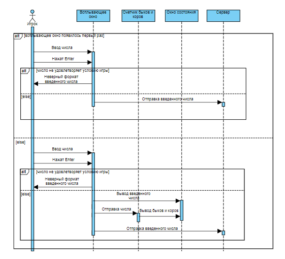
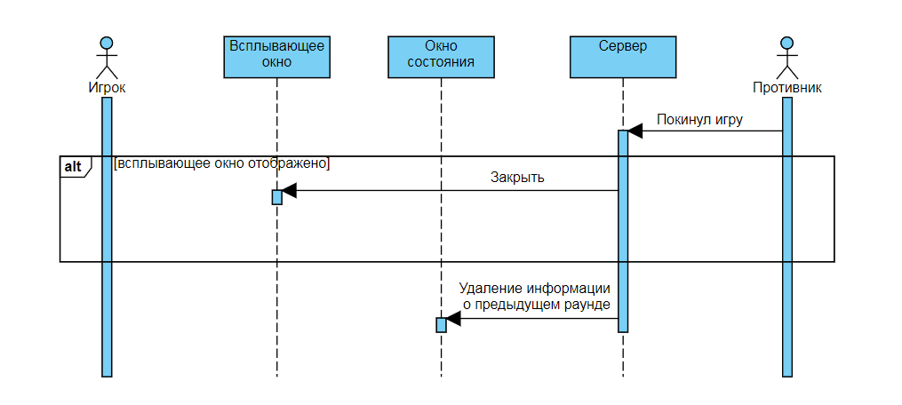
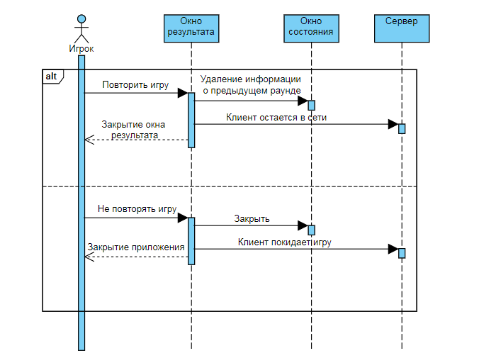

# Диаграммы последовательностей

# Содержание
1. [Сделать ход](#1)  
2. [Окончание игры во время раунда](#2)  
3. [Конец игры](#3)

<a name="1"/>

# 1. Сделать ход 

<a name="2"/>

# 2. Окончание игры во время раунда

<a name="3"/>

# 3. Конец игры

