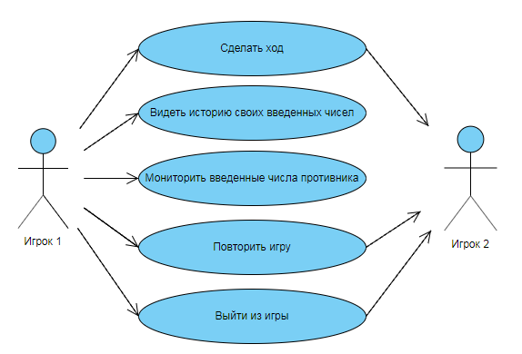

# Диаграмма вариантов использования

# Содержание

1. [Актёры](#1)  
2. [Варианты использования](#2)  
    2.1. [Сделать ход](#2.1)  
    2.2. [История своих введенных чисел](#2.2)  
    2.3. [Мониторинг введенных чисел противника](#2.3)  
    2.4. [Повтор игры](#2.4)  
    2.5. [Выход из игры](#2.5)  
    
        
 <a name="1"/>
 
 # 1 Актёры
 
| Актёр | Описание |
|:--|:--|
| Игрок 1 | Пользователь, подключенный к игре |
| Игрок 2 | Пользователь, подключенный к игре, является противником Игрока 1 |

# 2 Варианты использования

<a name="2.1"/>

## 2.1 Сделать ход
1. Появилось новое окно перед Игроком 1. 
2. При первом появлении окно запрашивает загадать свое число, которое Игрок 2 должен будет отгадать. 
3. При последующих появлениях окно  - число, которое, как кажется Игроку 1, является загаданным числом Игрока 2. 
4. Игрок 1 должен ввести 4-значное число с неповторяющимися цифрами. 
5. В случае если Игрок 1 ввел число, не удовлетворяющее условию игры, окно будет ожидать корректного ввода.

<a name="2.2"/>

## 2.2 История своих введенных чисел
1. После каждой попытки отгадать число Игрока 2, вводимые Игроком 1 числа будут заноситься в окно состояния, чтобы при последующих попытках Игрок 1, проанализировав ранее введенные значения , мог достичь цели игры.

<a name="2.3"/>

## 2.3 Мониторинг введенных чисел противника
1. При каждом введенном значении Игрока 2, его числа будут заноситься в окно состояния Игрока 1. Данная функция не является вспомогательной Игроку 1 для достижения цели игры, а нужна только если он захочет "предсказать" оставшееся количество ходов Игрока 2.

<a name="2.4"/>

## 2.4 Повтор игры
1. Раунд окончен. 
2. Появилось окна результата. 
3. На окне результата будет выведен результат и выбор: продолжить игру или не продолжать игру. 
4. Если Игрок 1 выберет продолжить, то информация о прошлом раунде будет стёрта(окно состояния очистится от ранее введенных данных), игра примет вид как в начале открытия данного приложения и будет ожидать Игрока 2. 
5. Если Игрок 1 выберет не продолжать игру, то приложение закроется.

<a name="2.5"/>

## 2.5 Выход из игры
1. Как было сказано выше, Игрок 1 имеет право выйти из игры по окончании раунда. 
2. Игрок 1 может выйти из игры во время раунда, просто закрыв данное приложение.
