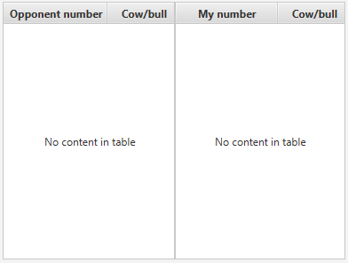
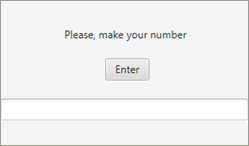
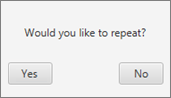

# Требования к проекту
---

# Содержание
1 [Введение](#intro)  
1.1 [Назначение](#appointment)  
1.2 [Бизнес-требования](#business_requirements)  
1.2.1 [Исходные данные](#initial_data) 

1.2.1.1 [Предыстория](#history) 

1.2.1.2 [Правила игры](#rules) 

1.2.2 [Возможности бизнеса](#business_opportunities)  
1.2.3 [Границы проекта](#project_boundary)  
1.3 [Аналоги](#analogues)  
2 [Требования пользователя](#user_requirements)  
2.1 [Программные интерфейсы](#software_interfaces)  
2.2 [Интерфейс пользователя](#user_interface)  
2.3 [Характеристики пользователей](#user_specifications)  
2.3.1 [Классы пользователей](#user_classes)  
2.3.2 [Аудитория приложения](#application_audience)  
2.3.2.1 [Целевая аудитория](#target_audience)  
2.3.2.1 [Побочная аудитория](#collateral_audience)  
2.4 [Предположения и зависимости](#assumptions_and_dependencies)  
3 [Системные требования](#system_requirements)  
3.1 [Функциональные требования](#functional_requirements)  
3.1.1 [Основные функции](#main_functions)  
3.1.1.1 [Вход пользователя в приложение](#user_logon_to_the_application)  
3.1.1.2 [Настройка профиля активного пользователя](#setting_up_the_profile_of_the_active_user)  
3.1.1.3 [Загрузка новостей](#download_news)  
3.1.1.4 [Просмотр информации об отдельной новости](#view_information_about_an_individual_newsletter)  
3.1.1.5 [Выход пользователя из учётной записи](#active_user_change)  
3.1.1.6 [Регистрация нового пользователя после входа в приложение](#add_new_user)  
3.1.2 [Ограничения и исключения](#restrictions_and_exclusions)  
3.2 [Нефункциональные требования](#non-functional_requirements)  
3.2.1 [Атрибуты качества](#quality_attributes)  
3.2.1.1 [Требования к удобству использования](#requirements_for_ease_of_use)  
3.2.1.2 [Требования к безопасности](#security_requirements)  
3.2.2 [Внешние интерфейсы](#external_interfaces)  
3.2.3 [Ограничения](#restrictions)  

<a name="intro"/>

# 1 Введение

<a name="appointment"/>

## 1.1 Назначение
В этом документе описаны функциональные и нефункциональные требования к сетевой игре «Bulls and Cows».

<a name="business_requirements"/>

## 1.2 Бизнес-требования

<a name="initial_data"/>

### 1.2.1 Исходные данные

<a name="history"/>

#### 1.2.1.1 Предыстория
С ростом технологий расширяется и мир игр. Первоисточником разрабатываемой игры «Bulls and Cows» является старая «добрая» игра «Быки-коровы» с бумагой и ручкой. Сначала игра была задумана для двух игроков, но с появлением компьютерных версий стал популярен вариант, когда игрок отгадывает число, задуманное программой, то есть играет в одиночку. В электронных версиях игру на расстоянии против противника обеспечивает функция многопользовательской игры.

<a name="rules"/>

#### 1.2.1.1 Правила игры
Каждый из игроков задумывает и вводит тайное 4-значное число с неповторяющимися цифрами. Игроки по очереди пытаются угадать число соперника, вводя комбинации, состоящие из 4 неповторяющихся цифр. По окончании хода игроку выводится количество содержащих в загаданном числе «коров» и «быков»: сколько цифр угадано без совпадения с их позициями в тайном числе и сколько угадано вплоть до позиции в тайном числе соответственно. Например:
Задумано тайное число «0751».
Попытка: «1795».
Результат: две «коровы» (две цифры: «1» и «5» — угаданы на неверных позициях) и один «бык» (одна цифра «7» угадана вплоть до позиции).
Побеждает тот, кто угадает число первым.

<a name="business_opportunities"/>

### 1.2.2 Возможности бизнеса
«Bulls and Cows» - сетевая игра для двоих, которая развивает	логичность мышления, счёт, память. Для неё достаточно иметь друга, свободное время и немного везения.

<a name="project_boundary"/>

### 1.2.3 Границы проекта
Приложение позволяет 

<a name="analogues"/>

## 1.3 Аналоги
Функции |[Kitchen Stories](https://play.google.com/store/apps/details?id=com.ajnsnewmedia.kitchenstories)| [MealBoard](http://itunes.apple.com/WebObjects/MZStore.woa/wa/viewSoftware?id=333425918&mt=8) | [SideChef](https://play.google.com/store/apps/details?id=com.sidechef.sidechef) 
--- | :-: | :-: | :-:
Доступно на Android |+|-|+
Поддержка русского языка | +|-|-
Бесплатно |+|-|-
Создание своего рецепта | -|+|+
Создание списка покупок | +|+|+

<a name="user_requirements"/>

# 2 Требования пользователя

<a name="software_interfaces"/>

## 2.1 Программные интерфейсы
Приложение обрабатывает RSS-ленты интернет-ресурсов, соответствующие стандартам RSS. 

<a name="user_interface"/>

## 2.2 Интерфейс пользователя
Окно отображения состояния игры.  
  
Окно для ввода(загадывания) своего числа.  
  
Окно для угадывания числа противника.  
  
Окно выбора повтора или окончания игры.  
  

<a name="user_specifications"/>

## 2.3 Характеристики пользователей

<a name="user_classes"/>

### 2.3.1 Классы пользователей

| Класс пользователей | Описание |
|:---|:---|
| Анонимные пользователи | Пользователи, которые не хотят регистрироваться в приложении. Имеют доступ к частичному функционалу |
| Зарегистрированные пользователи | Пользователи, которые вошли в приложение под своим именем (псевдонимом), желающие просматривать краткую информацию о новостях, отобранных согласно их предпочтениям. Имеют доступ к полному функционалу |

<a name="application_audience"/>

### 2.3.2 Аудитория приложения

<a name="target_audience"/>

#### 2.3.2.1 Целевая аудитория
Люди старшей возрастной категории со средним или выше среднего уровнем образования, обладающие минимальной технической грамотностью.

<a name="collateral_audience"/>

#### 2.3.2.2 Побочная аудитория
Люди средней возрастной категории, обладающие вышеперечисленными качествами.

<a name="assumptions_and_dependencies"/>

## 2.4 Предположения и зависимости
1. Приложение не работает при отсутствии подключения к Интернету;
2. Приложение не обрабатывает данные RSS-лент, недоступных в момент запроса.

<a name="system_requirements"/>

# 3 Системные требования

<a name="functional_requirements"/>

## 3.1 Функциональные требования

<a name="main_functions"/>

### 3.1.1 Основные функции

<a name="user_logon_to_the_application"/>

#### 3.1.1.1 Вход пользователя в приложение
**Описание.** Пользователь имеет возможность использовать приложение без создания собственного профиля либо войдя в свою учётную запись.

| Функция | Требования | 
|:---|:---|
| Вход в приложение без создания собственного профиля | Приложение должно предоставить пользователю возможность войти в приложение анонимно |
| <a name="registration_requirements"/>Регистрация нового пользователя | Приложение должно запросить у пользователя ввести имя для создания учётной записи. Пользователь должен либо ввести имя, либо отменить действие |
| *Пользователь с таким именем существует* | *Приложение должно известить пользователя об ошибке регистрации и запросить ввод псевдонима. Пользователь должен либо ввести псевдоним, либо отменить действие* |
| Вход зарегистрированного пользователя в приложение | Приложение должно предоставить пользователю список имён (псевдонимов) зарегестрированных пользователей. Пользователь должен либо выбрать из списка своё имя (псевдоним), либо отменить действие |

<a name="setting_up_the_profile_of_the_active_user"/>

#### 3.1.1.2 Настройка профиля активного пользователя
**Описание.** Зарегистрированный пользователь имеет возможность редактировать список ссылок на интернет-ресурсы, с которых производится выборка новостей, и списки (включений и исключений) ключевых фраз для фильтрации новостей.
 
| Функция | Требования | 
|:---|:---|
| Добавление интернет-ресурсов | Приложение должно предоставить зарегистрированному пользователю поле для ввода адреса RSS-ленты интернет-ресурса. Пользователь должен либо ввести адрес и подвердить действие, либо отменить его |
| Удаление интернет-ресурсов | Зарегистрированный пользователь имеет возможножность выделить адрес RSS-ленты в списке интернет-ресурсов и удалить его |
| Добавление ключевых фраз | Приложение должно предоставить зарегистрированному пользователю возможность выбрать список, в который будет добавлена фраза, и поле для её ввода. После выбора списка пользователь должен либо ввести фразу и подвердить действие, либо отменить его |
| Удаление ключевых фраз | Зарегистрированный пользователь имеет возможность выделить ключевую фразу в любом из списков и удалить её |

<a name="download_news"/>

#### 3.1.1.3 Загрузка новостей
**Описание.** После входа пользователя в приложение или после завершения радактирования профиля зарегистрированным пользователем необходимо загрузить информацию о новостях и отфильтровать их согласно спискам ключевых фраз.

| Функция | Требования | 
|:---|:---|
| Загрузка информации о новостях | Приложение должно загрузить информацию о новостях с интернет-ресурсов после входа пользователя в приложение или после завершения радактирования профиля зарегистрированным пользователем |
| Фильтрация новостей | Приложение должно отфильтровать новости согласно спискам ключевых фраз |

<a name="view_information_about_an_individual_newsletter"/>

#### 3.1.1.4 Просмотр информации об отдельной новости
**Описание.** Пользователь имеет возможность просмотреть информацию о каждой новости, представленной в таблице.

| Функция | Требования | 
|:---|:---|
| Просмотр краткой информации | Пользователь имеет возможность выбрать новость в таблице одинарным кликом по ней. Приложение должно отобразить её заголовок, описание и дату размещения "Подробнее" главного окна приложения |
| Просмотр подробной информации | Пользователь имеет возможность выбрать новость в таблице двойным кликом по ней. Приложение должно открыть полную версию страницы в браузере, установленном в системе по умолчанию |

<a name="active_user_change"/>

#### 3.1.1.5 Выход зарегистрированного пользователя из учётной записи
**Описание.** Зарегистрированный пользователь имеет возможность выйти из учётной записи.

**Требование.** Приложение должно предоставить зарегистрированному пользователю возможность выйти из учётной записи с возвратом к окну входа в приложение.

<a name="add_new_user"/>

#### 3.1.1.6 Регистрация нового пользователя после входа в приложение
**Описание.** Анонимный пользователь имеет возможность зарегистрироваться в приложении.

**Требование.** Приложение должно предоставить анонимному пользователю возможность [зарегистрироваться в приложении](#registration_requirements). 

<a name="restrictions_and_exclusions"/>

### 3.1.2 Ограничения и исключения
1. Приложение работает только при наличии подключения к Интернету;
2. Отслеживание новостей интернет-ресурса осуществляется при наличии у последнего RSS-ленты. 

<a name="non-functional_requirements"/>

## 3.2 Нефункциональные требования

<a name="quality_attributes"/>

### 3.2.1 Атрибуты качества

<a name="requirements_for_ease_of_use"/>

#### 3.2.1.1 Требования к удобству использования
1. Доступ к основным функциям приложения не более чем за две операции;
2. Все функциональные элементы пользовательского интерфейса имеют названия, описывающие действие, которое произойдет при выборе элемента;
3. Пошаговая инструкция использования основных функций приложения отображена в справке;
4. Обновление информации о новостях происходит каждые 15 минут в фоновом режиме.

<a name="security_requirements"/>

#### 3.2.1.2 Требования к безопасности
Приложение предоставляет возможность просмотра и редактирования профиля только активного пользователя.

<a name="external_interfaces"/>

### 3.2.2 Внешние интерфейсы
Окна приложения удобны для использования пользователями с плохим зрением:
  * размер шрифта не менее 14пт;
  * функциональные элементы контрастны фону окна.

<a name="restrictions"/>

### 3.2.3 Ограничения
1. Приложение реализовано на платформе .NET Framework 4.6;
2. Профиль пользователя хранится в файле с расширением XML, название файла совпадает с именем (псевдонимом).
